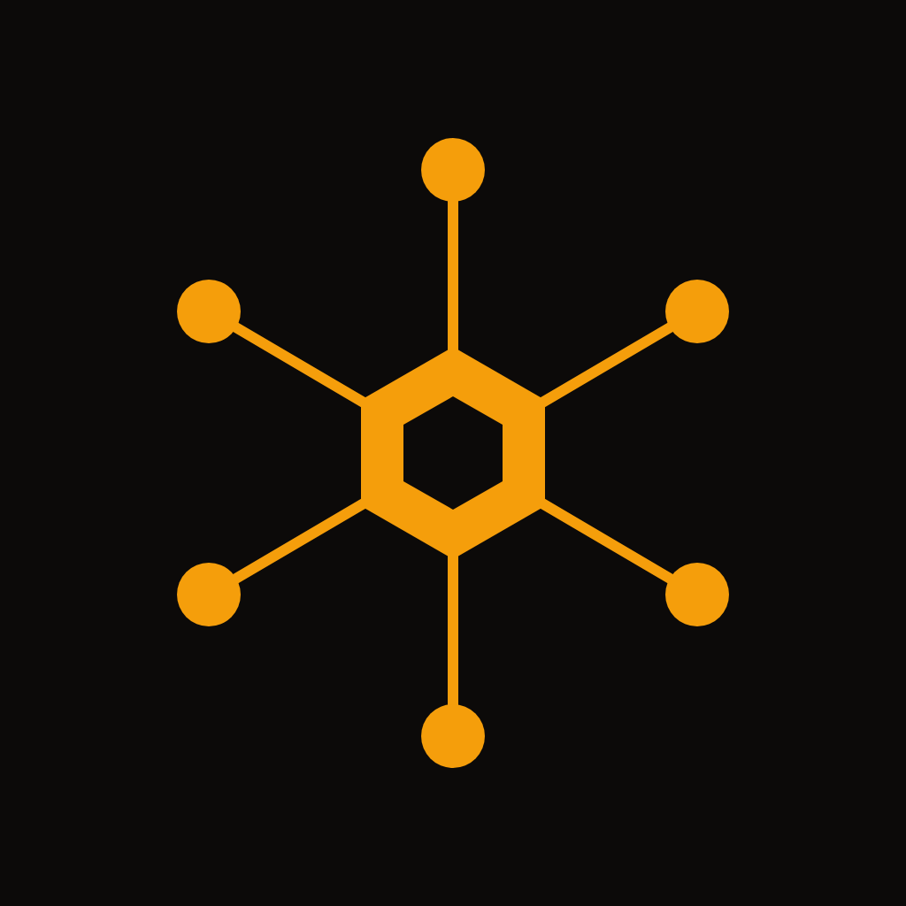
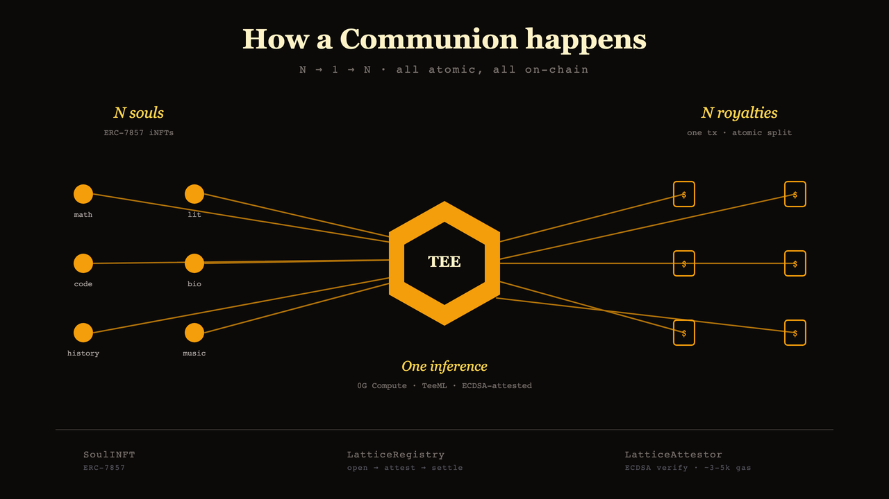

<p align="center">
  
</p>

<h1 align="center">The Lattice</h1>

<p align="center">
  A multi-party communion primitive for ERC-7857 souls. N agents share one
  TEE-attested inference and the payment fans N ways atomically on settlement.
</p>

<p align="center"><sub>
  Submission for the 0G APAC Hackathon 2026 — Track 1, Agentic Infrastructure.
</sub></p>

## What it does

Each Soul is an ERC-7857 iNFT carrying an encrypted context blob — a tutor's
pedagogy, a researcher's worldview, a curator's taste. One soul on its own
runs ordinary inferences. The Lattice composes N of them.

A payer picks the souls, writes a question, and pays. Each soul owner signs
a participation receipt with their wallet. The orchestrator pulls the
N encrypted contexts out of 0G Storage, merges them inside a TEE, and runs
one inference. The TEE provider returns an ECDSA-signed envelope; the
on-chain attestor verifies it (~3-5k gas, vs 5-15M for a full DCAP quote);
the registry splits the payment N ways and emits the settlement event.

Three contracts handle the lifecycle:

- `SoulINFT` — ERC-7857 iNFT with a `royaltyWallet` field per soul
- `LatticeAttestor` — registered TEE providers, verifies ECDSA + chatID
- `LatticeRegistry` — open → attest → settle, with replay protection

## Architecture

<p align="center">
  
</p>

A longer write-up of the trust model, contract surface, and orchestrator API
is in [`docs/ARCH.md`](docs/ARCH.md).

## 0G integration

Three of the 0G stack's core components are load-bearing in this protocol.

**0G Storage** carries every soul's encrypted context. The orchestrator
encrypts the context blob client-side, uploads via `@0gfoundation/0g-storage-ts-sdk`,
and gets back a 32-byte Merkle root that becomes the soul iNFT's `dataHash`.
Anyone can read the ciphertext from the indexer; only the orchestrator and
the TEE hold the decrypt key. The integration lives in
[`orchestrator/src/lib/zerog-storage.ts`](orchestrator/src/lib/zerog-storage.ts).
What it solves: per-soul context privacy that survives ownership transfer
(via ERC-7857's re-encryption emit).

**0G Compute** (TeeML) runs the merged-context inference. The orchestrator
submits an OpenAI-shape body to a registered TeeML provider via
`@0gfoundation/0g-compute-ts-sdk`, then fetches `GET /v1/proxy/signature/{chatID}`
to retrieve the ECDSA-attested response envelope. Code path:
[`orchestrator/src/lib/zerog-compute.ts`](orchestrator/src/lib/zerog-compute.ts).
What it solves: a single trusted inference over N otherwise-independent souls'
contexts.

**0G Chain** hosts the three contracts that orchestrate the lifecycle —
deployed on Galileo (chain 16602) at the addresses below. Verification of
the TEE signature is ~3-5k gas via EIP-191 ECDSA; full DCAP quote verify
(5-15M gas) is on the v2 roadmap. Source: [`contracts/src/`](contracts/src/).
What it solves: trust-minimized escrow + atomic N-way royalty fan-out in
one transaction.

## Live

```
UI            https://lattice-guzus.vercel.app
Orchestrator  https://lattice-orchestrator-production.up.railway.app
Explorer      https://chainscan.0g.ai
```

Deployed on **0G Aristotle mainnet (chain 16661)**:

| Contract | Address |
|---|---|
| `SoulINFT` | `0x0CebA1d805118e1e6E236bF32B3A0474BAB6c86E` |
| `LatticeAttestor` | `0x9E6F13150A87B9E0680A0B53FcfdfaDDB402ec7b` |
| `LatticeRegistry` | `0xd0321F99d6025BCECBD6CA5fC08510dfee61EeEA` |
| `DataVerifier` | `0x4a1234412A5B1da4220C3D86eE0b220a3A72411F` |

Same addresses are also live on Galileo testnet (chain 16602) — the
deployer wallet's nonce sequence on each chain produced identical
CREATE addresses. Verify on either explorer.

## Demo

[`docs/demo.mp4`](docs/demo.mp4) — 25 seconds of a real on-chain run: three
souls minted, communion opened, TEE-attested, royalties split. Every tx is
verifiable on the Galileo explorer. The script that drives it is at
[`docs/demo/demo.sh`](docs/demo/demo.sh); regenerate from a fresh run with
`bash docs/demo/regen.sh`.

UI screenshots in [`docs/demo/`](docs/demo/).

## Run it locally

You need Node ≥ 22, pnpm 9, Foundry, and a wallet with testnet OG (faucet
at https://faucet.0g.ai).

```bash
git clone <this-repo>
cd lattice
cp .env.example .env       # fill DEPLOYER_PRIVATE_KEY etc.
pnpm install

# Deploy (testnet)
cd contracts
forge script script/DeployLattice.s.sol \
  --rpc-url $ZEROG_RPC_URL --broadcast --slow \
  --private-key $DEPLOYER_PRIVATE_KEY

# Copy the printed addresses into .env, then start the dev stack
cd ..
pnpm --filter @lattice/orchestrator dev   # http://localhost:3001
pnpm --filter @lattice/ui dev             # http://localhost:3000
```

Mainnet writes burn real OG. Default to `https://evmrpc-testnet.0g.ai` until
you've verified the flow end-to-end.

## Test wallet & networks

The protocol is live on both 0G chains. Judges can verify on either:

| | Mainnet | Testnet |
|---|---|---|
| Network | 0G Aristotle | 0G Galileo |
| Chain ID | 16661 | 16602 |
| RPC URL | `https://evmrpc.0g.ai` | `https://evmrpc-testnet.0g.ai` |
| Explorer | `https://chainscan.0g.ai` | `https://chainscan-galileo.0g.ai` |
| Faucet | — (real OG; KuCoin / Gate.io / MEXC) | https://faucet.0g.ai |

Connect any wallet (MetaMask, Rabby, Frame) at
https://lattice-guzus.vercel.app and switch to the chain you want to use.
~0.05 OG covers the gas for one full mint → communion → settle cycle.

The orchestrator's deployer wallet — `0xF5B0173917c322996157Ad1e6f482B33B9a72a8E` —
mints souls and pays gas for on-chain attestations. Its private key is held
only by the Railway-hosted orchestrator; judges don't need it. Anything
visible in the live UI was minted from a wallet via the form, not via
elevated access.

### Proof of mainnet integration

Real on-chain activity from 2026-05-11 deploy + seed run:

- 5 souls minted: [#0 math](https://chainscan.0g.ai/tx/0x32b6236ef2cffa0eff463904bc901ca5f9e7bdf1fc91e8094f50bcd512287a28),
  [#1 lit](https://chainscan.0g.ai/tx/0xc3b8aa6da59aef0c1e43706dfcaccefab10274a9c8b286d7f3b3201e6979ea08),
  [#2 physics](https://chainscan.0g.ai/tx/0x865ca5cf3c150815a4388dcde748d967ecb7f65b84edf0bd5256568a4d86e45d),
  [#3 code](https://chainscan.0g.ai/tx/0x8efddd1f27aa3aaaad3841b4db17c9664f2bd3f63d9b62183e2f465c48e5df9f),
  [#4 music](https://chainscan.0g.ai/tx/0x6cccdf2cd34a0ff8aa11cf2bfaba3f94ea2012865c7cd598dbde8916fa7d65ef)
- 3-way Communion: [open](https://chainscan.0g.ai/tx/0x2471503dd17b41c10c8f0152037150182c07bb74c26bbfe3c94d4f6f50df36d4) →
  [attest](https://chainscan.0g.ai/tx/0xf235861b186e88efe73791c4fcbf6ed9e841c42c73061a78dbfb41e368ed8645) →
  [settle (3-way fan-out)](https://chainscan.0g.ai/tx/0x718dc507e6e657ee5dfe020c89f1fdb3f61007ae9e3e181b27c17c489d197c76)

## Caveats

A few things to be honest about. They're in the demo too at `/disclosures`.

**TEE attestation is ECDSA, not DCAP.** The 0G Compute SDK signs the response
text whose payload is `requestHash(32) || cost(16)`. We verify that signature
against a registered provider key per inference. Full Intel TDX DCAP quote
verification (5-15M gas) is on the v2 path.

**Soul-input binding is an orchestrator commitment.** The TEE doesn't sign the
request body, so soul IDs are bound by an on-chain commitment
(`provider, chatID, sortedSoulIds, outputHash, usageHash`) submitted alongside
the response. A malicious orchestrator could collect N receipts and forward
only K<N contexts; the TEE wouldn't notice. Per-context TEE attestation is the
v2 path.

**The hosted orchestrator falls back to a templated string** when the 0G
Compute broker isn't funded. Once funded, it switches to real `deepseek-v3`
inference automatically. The path is `orchestrator/src/lib/zerog-compute.ts`.

**Soul re-encryption-on-transfer** (the ERC-7857 special move) is implemented
in `SoulINFT` but not exercised in the demo path.

## Layout

```
contracts/    Solidity 0.8.26, Foundry. Three contracts + a pure royalty-split
              helper. Tests live under contracts/test (forge test -vv).
orchestrator/ Fastify server, ethers v6, zod-validated env. Dockerfile is
              what Railway uses. Tests under orchestrator/tests (vitest).
ui/           Next.js App Router, wagmi v2, RainbowKit. Vercel-ready.
docs/         ARCH.md (longer architecture notes), demo bundle.
```

## License

MIT.
